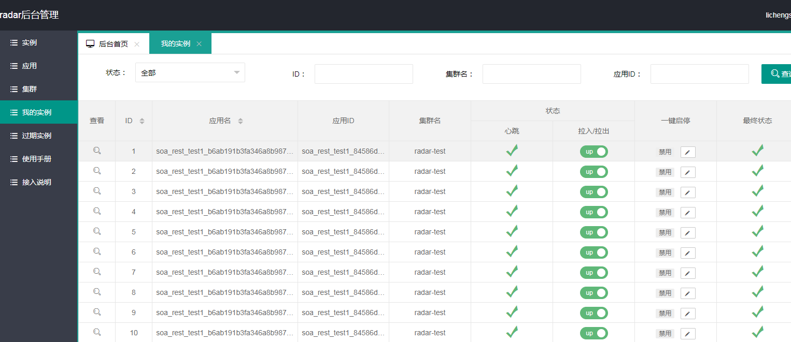

# Radar 拍拍贷微服务`注册中心`组件介绍

Radar（雷达）是拍拍贷研发一款分布式注册中心，能够管理不同应用在不同集群下多实例的应用信息。具有部署和运维简单的特性。注册中心采用mysql数据库进行数据存储，实例和配置变更能实现秒级通知客户端。

注册中心服务端基于Spring Boot开发，打包后可以直接运行，不需要额外安装Tomcat等应用容器。

注册中心原生客户端不依赖任何框架，能够运行于所有Java1.8+运行时环境，同时对Spring Mvc/Spring Boot环境也有额外支持。

本地快速部署请参见 wiki [`快速部署`](https://github.com/SpringCloud/spring-cloud-radar/wiki/2.Radar%E5%BF%AB%E9%80%9F%E9%83%A8%E7%BD%B2)

# Screenshots

# Features
注册中心有以下特点：

1. 实现简单， 没有采用复杂的Raft等分布式一致性算法， 节点间状态同步仅通过mysql数据库实现。
2. 服务端和客户端轻量， 依赖少， 服务端仅依赖mysql数据库。
3. 高性能， 一个服务节点即可支撑上千个服务实例的注册发现。
4. 支持集群模式和HA， 可以水平扩容。
5. 提供完善服务治理界面， 用户通过UI即可对服务实例执行拉入拉出等操作。
6. 提供完善API， 方便其它系统例如发布系统对接。
7. 支持同一服务通过集群(cluster)名进行逻辑隔离。
8. 支持对接Spring/Ribbon客户端软负载。
9. 支持容器漂移， 通过设置canInstanceId标识， 应用实例启动时可以保持上次的状态信息。

# 欢迎加入radar讨论群
